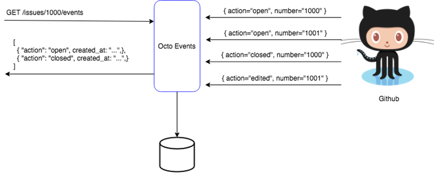

# Octo Events


## 1. Endpoint Webhook

O endpoint Webhook recebe eventos do Github e os salva no banco. Para saber mais sobre Webhooks sugiro a seguinte leitura nos documentos:

* Webhooks Overview: https://developer.github.com/webhooks/ 
* Creating Webhooks : https://developer.github.com/webhooks/creating/

O endpoint está disponibilizado em `/events`

## 2. Endpoint Events 

O endpoint Events está expondo eventos por uma API que os filtrará através do número da issue:

**Request:**

> GET /issues/1000/events

**Response:**

> 200 OK
```javascript
[ 
  { "action": "open", created_at: "...",}, 
  { "action": "closed", created_at: "...",} 
]
```

   GitHub


O projeto foi desenvolvido utilizando Java e Spring.

Instruções execuções:
- Executa usando JDK 1.8
- Utilizar Lombok habilitado como plugin
- Realizar configurações do PostgreeSQL banco estrutural